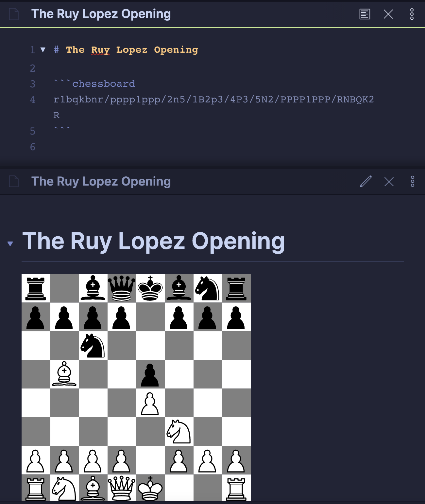
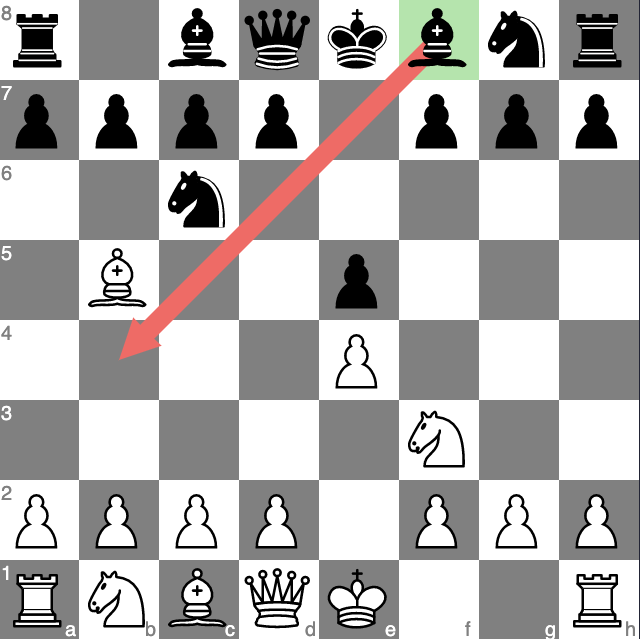

# Obsidian Chess Plugin

This plugin adds the capability to visualize Chess [FEN](https://en.wikipedia.org/wiki/Forsyth%E2%80%93Edwards_Notation) positions on a SVG chessboard directly in preview mode.

By design, this plugin is for visualization only. Do not expect interactivity or the possibility to handle entire games in PGN format. This plugin want to render just a SVG image and it is optimized for visualization and HTML/PDF exports.

If you want a more interactive plugin, I recommend [Chesser](https://github.com/SilentVoid13/Chesser).

## How to use it

After you installed the plugin, just write the FEN position representation inside a code block with the `chessboard` language.

### Example

````
```chessboard
fen: r1bqkbnr/pppp1ppp/2n5/1B2p3/4P3/5N2/PPPP1PPP/RNBQK2R
```
````



### Change Board Orientation

Use the `orientation` command. It can be `white` (default) or `black`.

````
```chessboard
fen: r1bqkbnr/pppp1ppp/2n5/1B2p3/4P3/5N2/PPPP1PPP/RNBQK2R
orientation: black
```
````

## Annotations (Beta)

You can annotate your schema with arrows and highlights.

````
```chessboard
fen: r1bqkbnr/pppp1ppp/2n5/1B2p3/4P3/5N2/PPPP1PPP/RNBQK2R
annotations: Af8-b4 Hf8
```
````



### Syntax

- `A<square>-<square>`, draws an arrow from the first square to the second square. E.g., `Af8-b4`.
- `H<square>`, highlight a specific square. E.g., `Hf8`.

## How to compile the plugin

First, install the dependencies with

```bash
npm i
```

Then, you can compile the plugin with:

```bash
npm run build
```

This will create a `main.js` file in the project root. That is the entry point of the plugin.

## Planned Features

- [ ] Chessboard color customization.
- [x] Chessboard annotation and highlights.

## Chess Pieces

The SVG pieces were made by jurgenwesterhof (adapted from work of Cburnett), CC BY-SA 3.0 <https://creativecommons.org/licenses/by-sa/3.0>, via [Wikimedia Commons](https://commons.wikimedia.org/wiki/File:Chess_Pieces_Sprite.svg).
